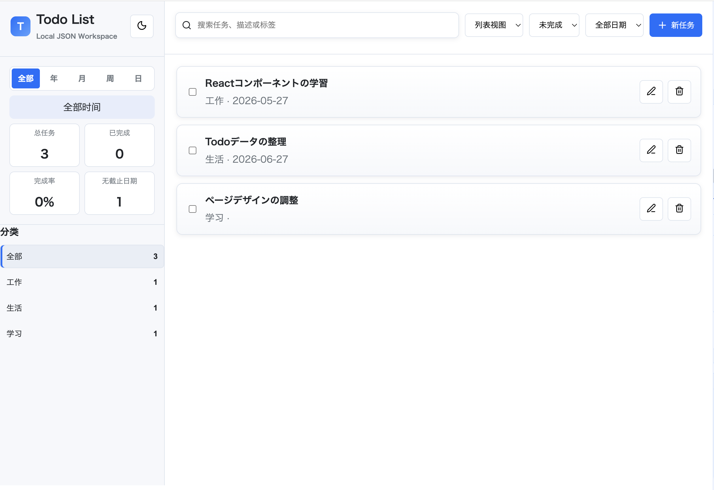
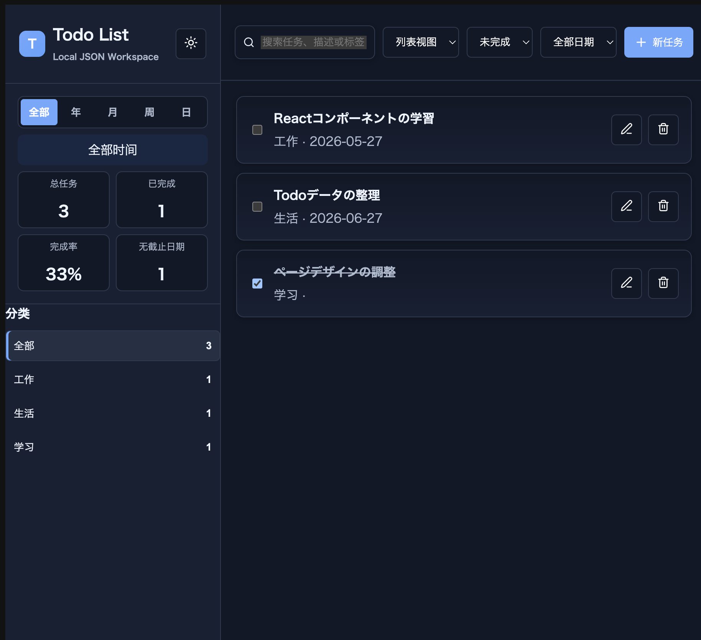
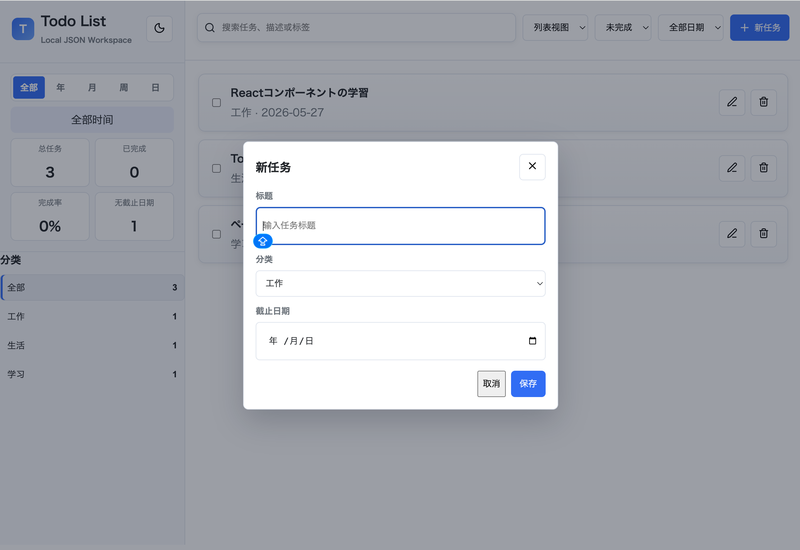

# Web ToDo管理アプリ

ReactとTypeScriptを使用して制作したタスク管理Webアプリです。

タスクの追加・編集・削除、検索、カテゴリ管理、予定日の設定などに対応しています。登録したデータはブラウザの`localStorage`に保存されます。

## アプリプレビュー

https://vinkinweng.github.io/TodoList_react/



## 主な機能

### 実装済み

- タスクの追加・編集・削除
- 完了・未完了状態の切り替え
- タスクの検索
- カテゴリの設定・カテゴリ別表示
- 予定日の設定
- `localStorage`へのデータ保存
- ライトモード・ダークモードの切り替え

### 開発中

- 完了タスクの自動並び替え
- 予定日による並び替え
- カレンダー表示
- 年・月・週・日ごとのタスク表示

## 使用技術

- React
- TypeScript
- Vite
- localStorage

## 画面イメージ

### ライトモード


### ダークモード



### タスクの追加・編集



## 実行方法

```bash
git clone -b develop https://github.com/vinkinweng/TodoList_react.git
cd TodoList_react
npm install
npm run dev
```